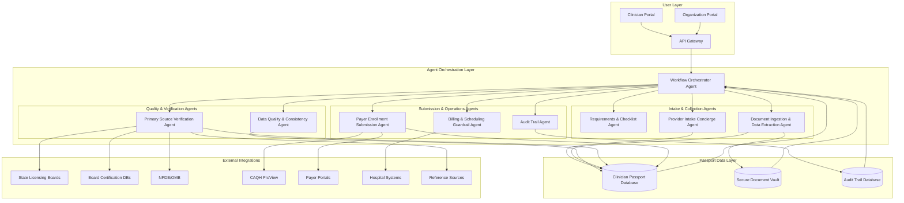
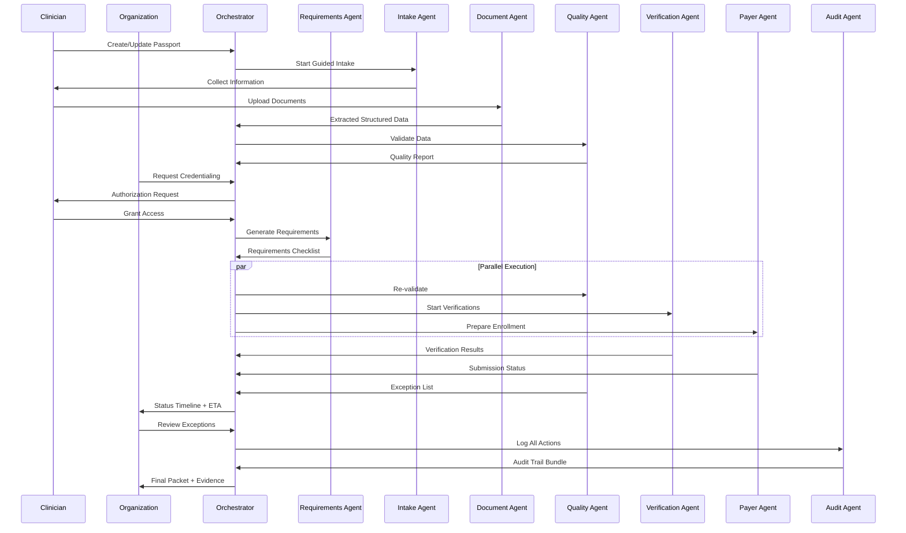
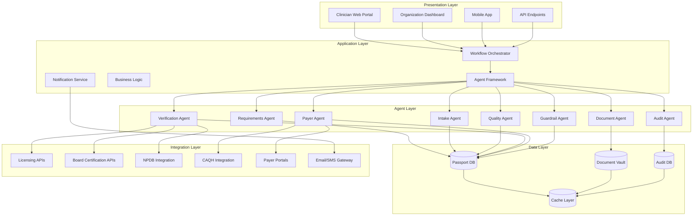

# Credentialing Passport for Clinicians - Architecture Diagram

## System Architecture Overview

## Detailed Component Architecture

```mermaid
graph LR
    subgraph "1. Passport Creation Flow"
        A1[Clinician Registration] --> A2[Guided Intake]
        A2 --> A3[Document Upload]
        A3 --> A4[Data Extraction]
        A4 --> A5[Structured Profile]
        A5 --> A6[Passport Storage]
    end
    
    subgraph "2. Authorization & Mapping"
        B1[Access Request] --> B2[Clinician Authorization]
        B2 --> B3[Requirements Mapping]
        B3 --> B4[Gap Analysis]
    end
    
    subgraph "3. Parallel Agent Execution"
        C1[Workflow Orchestrator] --> C2[Quality Check]
        C1 --> C3[Verification]
        C1 --> C4[Document Prep]
        C1 --> C5[Application Gen]
        C2 --> C6[Fix List]
        C3 --> C7[Verification Results]
        C4 --> C8[Packet Assembly]
        C5 --> C9[Submission Ready]
    end
    
    subgraph "4. Submission & Tracking"
        D1[Payer Submission] --> D2[Status Tracking]
        D1 --> D3[Hospital Submission]
        D2 --> D4[Exception Handling]
        D3 --> D4
        D4 --> D5[Final Approval]
    end
    
    subgraph "5. Continuous Monitoring"
        E1[Expiration Monitoring] --> E2[Auto Updates]
        E1 --> E3[Recredentialing Alerts]
        E2 --> E4[Passport Refresh]
    end
    
    A6 --> B1
    B4 --> C1
    C9 --> D1
    D5 --> E1
```

## Data Model Architecture

```mermaid
erDiagram
    PASSPORT ||--o{ IDENTITY : contains
    PASSPORT ||--o{ EDUCATION : contains
    PASSPORT ||--o{ WORK_HISTORY : contains
    PASSPORT ||--o{ LICENSES : contains
    PASSPORT ||--o{ BOARD_CERT : contains
    PASSPORT ||--o{ MALPRACTICE : contains
    PASSPORT ||--o{ DISCLOSURES : contains
    PASSPORT ||--o{ REFERENCES : contains
    PASSPORT ||--o{ ENROLLMENT : contains
    PASSPORT ||--o{ DOCUMENTS : references
    
    IDENTITY {
        string names_aliases
        date dob
        string ssn
        address[] address_history
        contact contact_info
    }
    
    EDUCATION {
        string medical_school
        string residency
        string fellowship
        date[] dates
    }
    
    WORK_HISTORY {
        string[] employers
        string[] hospital_appointments
        privilege[] privileges
        date[] date_ranges
    }
    
    LICENSES {
        state_license[] state_licenses
        string dea_number
        string[] cds_registrations
        date[] expiration_dates
    }
    
    BOARD_CERT {
        string[] certifications
        date[] expiration_dates
        moc_status maintenance_of_cert
    }
    
    MALPRACTICE {
        string carrier
        string policy_number
        loss_run[] loss_runs
        claim[] claims_history
    }
    
    DISCLOSURES {
        sanction[] sanctions
        disciplinary_action[] discipline
        criminal_record[] criminal
        dea_action[] dea_actions
    }
    
    REFERENCES {
        peer[] peer_references
        date[] contact_dates
    }
    
    ENROLLMENT {
        location[] practice_locations
        string ein
        w9_form w9
        eft_info eft
        specialty[] specialties
        taxonomy[] taxonomies
    }
    
    DOCUMENTS {
        string document_id
        string source_artifact
        date upload_date
        verification_receipt[] verifications
    }
```

## Agent Interaction Flow

## System Layers

## Key Architectural Principles

### 1. **Passport as Single Source of Truth**
- All clinician data stored once in structured format
- Document vault with provenance tracking
- Version-controlled updates with audit trail

### 2. **Agent-Based Parallel Processing**
- Workflow Orchestrator manages dependencies
- Agents execute in parallel where possible
- Real-time status updates and ETA calculations

### 3. **Evidence-Based Verification**
- Every field linked to source artifact
- Verification receipts stored with timestamps
- Audit-ready evidence bundles

### 4. **Exception-Driven Workflow**
- Automated handling of routine tasks
- Human intervention only for true exceptions
- Smart escalation based on probability models

### 5. **Continuous Readiness**
- Background monitoring for expirations
- Proactive updates and alerts
- Instant packet generation for new destinations

## Technology Stack Recommendations

- **Backend**: Python/FastAPI or Node.js/TypeScript
- **Agent Framework**: LangChain, AutoGPT, or custom orchestration
- **Database**: PostgreSQL for structured data, S3/Blob storage for documents
- **Cache**: Redis for real-time status and session management
- **Queue**: RabbitMQ or AWS SQS for agent task distribution
- **Integration**: REST APIs, webhooks, and browser automation for portals
- **Frontend**: React/TypeScript with real-time updates via WebSockets
- **Security**: End-to-end encryption, HIPAA compliance, role-based access control

